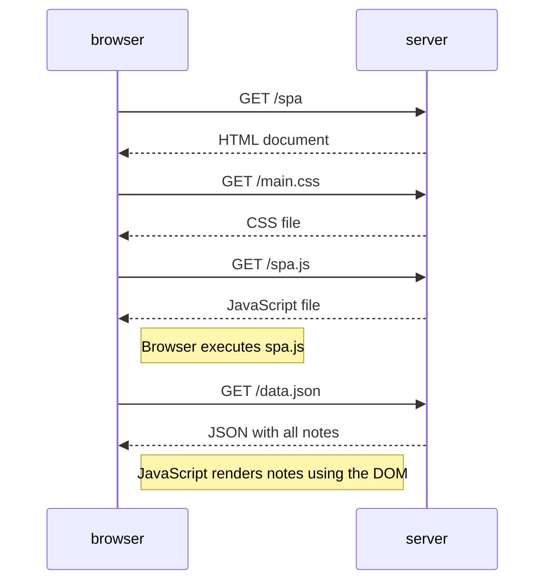

# 0.5: Single Page App diagram

```mermaid
sequenceDiagram
    participant browser
    participant server

    browser->>server: GET /spa
    server-->>browser: HTML document

    browser->>server: GET /main.css
    server-->>browser: CSS file

    browser->>server: GET /spa.js
    server-->>browser: JavaScript file

    Note right of browser: Browser executes spa.js

    browser->>server: GET /data.json
    server-->>browser: JSON with all notes

    Note right of browser: JavaScript renders notes using the DOM
```